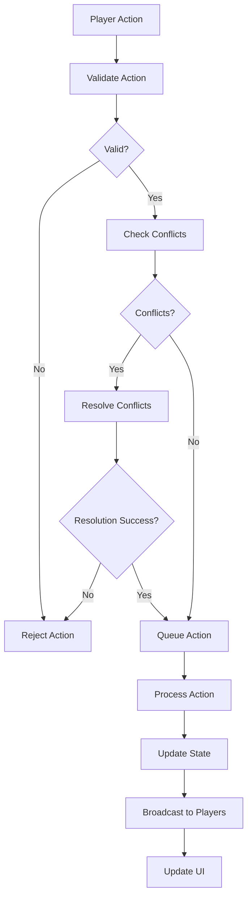

# Multiplayer MapSystem Refactoring Summary

## 🎯 Overview

The MapSystem class has been refactored to support multiplayer functionality with centralized game state management, conflict resolution, action queuing, and state validation/rollback mechanisms.

## 🔄 Key Changes

### 1. **Centralized Game State Management**

**Before:**
```javascript
class MapSystem {
    constructor() {
        this.cells = [];
        this.selectedAttribute = 'grassland';
        // ... other local state
    }
}
```

**After:**
```javascript
class MultiplayerMapSystem {
    constructor() {
        this.gameState = {
            id: null,
            roomCode: null,
            status: 'waiting',
            players: new Map(),
            currentPlayerId: null,
            turnOrder: [],
            currentTurn: 0,
            actionQueue: [],
            pendingActions: new Map(),
            conflictResolution: {
                enabled: true,
                mode: 'turn-based', // or 'real-time'
                lockDuration: 5000
            }
        };
        // ... other state
    }
}
```

### 2. **Conflict Resolution System**

**New Features:**
- **Cell Conflicts**: Detect when multiple players try to place buildings on the same cell
- **Resource Conflicts**: Validate resource availability before actions
- **Timestamp-based Resolution**: First-come-first-served for real-time mode
- **Turn-based Resolution**: Queue actions until player's turn

**Implementation:**
```javascript
detectConflicts(action) {
    const conflicts = [];
    
    // Check for cell conflicts
    if (action.type === 'place_building') {
        this.gameState.pendingActions.forEach(pendingAction => {
            if (pendingAction.data.row === action.data.row && 
                pendingAction.data.col === action.data.col) {
                conflicts.push({
                    type: 'cell_conflict',
                    actionId: pendingAction.id,
                    playerId: pendingAction.playerId
                });
            }
        });
    }
    
    return conflicts;
}
```

### 3. **Action Queuing System**

**Turn-based Mode:**
```javascript
queueAction(action) {
    // Validate action
    if (!this.validateAction(action)) {
        this.emit('actionRejected', { action, reason: 'Validation failed' });
        return false;
    }
    
    // Add to queue
    this.gameState.actionQueue.push(action);
    
    // Process based on mode
    if (this.gameState.conflictResolution.mode === 'real-time') {
        this.processActionImmediately(action);
    } else {
        this.processActionOnTurn(action);
    }
}
```

**Real-time Mode:**
- Actions processed immediately
- Conflicts resolved by timestamp
- Faster gameplay experience

### 4. **State Validation and Rollback**

**Validation System:**
```javascript
validateAction(action) {
    // Check if it's the player's turn
    if (!this.isCurrentPlayerTurn()) return false;
    
    // Check if game is active
    if (this.gameState.status !== 'active') return false;
    
    // Type-specific validation
    switch (action.type) {
        case 'place_building':
            return this.validatePlaceBuilding(action.data);
        case 'remove_building':
            return this.validateRemoveBuilding(action.data);
        default:
            return false;
    }
}
```

**Rollback System:**
```javascript
createRollbackPoint() {
    const rollbackPoint = {
        timestamp: Date.now(),
        gameState: JSON.parse(JSON.stringify(this.gameState)),
        mapState: this.getMapState(),
        playerState: { ...this.currentPlayer }
    };
    
    this.rollbackStack.push(rollbackPoint);
}

rollbackToPoint(rollbackPoint) {
    this.gameState = rollbackPoint.gameState;
    this.loadMapFromState(rollbackPoint.mapState);
    this.currentPlayer = rollbackPoint.playerState;
}
```

## 🏗️ Architecture Changes

### **State Management Flow**



### **Event System**

**New Event Types:**
- `gameStateChange` - Game state updated
- `playerAction` - Action processed successfully
- `actionQueued` - Action added to queue
- `actionRejected` - Action rejected
- `conflictDetected` - Conflict found
- `connectionChange` - Connection status changed

**Usage:**
```javascript
mapSystem.on('gameStateChange', (newState, oldState) => {
    updateUI(newState);
});

mapSystem.on('actionRejected', (data) => {
    showError(`Action rejected: ${data.reason}`);
});
```

## 🔧 Integration Points

### **1. Socket.io Integration**

```javascript
// Connect to server
const socket = io('http://localhost:5000');
mapSystem.connectToServer(socket);

// Handle server events
socket.on('game_action_broadcast', (data) => {
    mapSystem.handleRemoteAction(data);
});
```

### **2. Backend API Integration**

```javascript
// Join game
const response = await fetch('/api/game/join/ABC123', {
    method: 'POST',
    headers: { 'Authorization': 'Bearer ' + token }
});
const gameData = await response.json();
mapSystem.initializeGameState(gameData.game);
```

### **3. UI Integration**

```javascript
// Update player list
function updatePlayerList(players) {
    players.forEach(player => {
        const element = document.createElement('div');
        element.innerHTML = `
            <span style="color: ${player.color}">${player.username}</span>
            <span>Score: ${player.score}</span>
        `;
        playerList.appendChild(element);
    });
}
```

## 📊 Performance Optimizations

### **1. Action Batching**
```javascript
// Batch multiple actions
const actions = [
    { type: 'place_building', data: { row: 1, col: 1, attribute: 'road' } },
    { type: 'place_building', data: { row: 1, col: 2, attribute: 'road' } }
];
actions.forEach(action => mapSystem.queueAction(action));
```

### **2. State Caching**
```javascript
// Cache frequently accessed data
const playerCache = new Map();
gameState.players.forEach(player => {
    playerCache.set(player.id, player);
});
```

### **3. Rollback Stack Management**
```javascript
// Limit rollback stack size
if (this.rollbackStack.length > 10) {
    this.rollbackStack.shift();
}
```

## 🎮 Game Modes

### **Turn-based Mode**
- Players take turns
- Actions queued until player's turn
- No simultaneous conflicts
- Clear turn indicators

### **Real-time Mode**
- Simultaneous actions allowed
- Timestamp-based conflict resolution
- Faster gameplay
- More complex conflict handling

## 🛡️ Security Features

### **1. Action Validation**
- Server-side validation for all actions
- Client-side pre-validation for better UX
- Resource validation before placement

### **2. State Synchronization**
- Server is authoritative source of truth
- Client state can be rolled back
- Conflict resolution prevents cheating

### **3. Connection Handling**
- Automatic reconnection attempts
- Graceful disconnection handling
- State recovery on reconnection

## 📈 Benefits

### **1. Scalability**
- Supports multiple concurrent games
- Efficient state management
- Minimal memory overhead

### **2. Reliability**
- Robust conflict resolution
- State validation and rollback
- Error handling and recovery

### **3. Maintainability**
- Modular architecture
- Clear separation of concerns
- Comprehensive event system

### **4. User Experience**
- Smooth multiplayer gameplay
- Real-time updates
- Conflict resolution feedback

## 🚀 Migration Path

### **Phase 1: Basic Integration**
1. Replace MapSystem with MultiplayerMapSystem
2. Add Socket.io client
3. Implement basic multiplayer UI

### **Phase 2: Advanced Features**
1. Add conflict resolution UI
2. Implement turn indicators
3. Add player management

### **Phase 3: Polish**
1. Add chat system
2. Implement spectating
3. Add replay functionality

## 📝 Usage Examples

### **Basic Setup**
```javascript
const mapSystem = new MultiplayerMapSystem({
    mapSize: { rows: 60, cols: 60 },
    conflictResolution: {
        mode: 'turn-based',
        enabled: true
    }
});

// Connect to server
const socket = io('http://localhost:5000');
mapSystem.connectToServer(socket);
```

### **Queue Action**
```javascript
const actionId = mapSystem.queueAction({
    type: 'place_building',
    data: {
        row: 10,
        col: 15,
        attribute: 'road',
        class: 'road'
    }
});
```

### **Handle Events**
```javascript
mapSystem.on('gameStateChange', (newState) => {
    updatePlayerList(newState.players);
    updateTurnIndicator(newState);
});
```

This refactoring provides a solid foundation for multiplayer city building with robust conflict resolution, state management, and scalability features!

